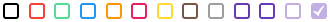
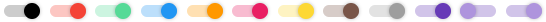
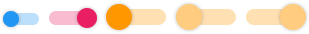
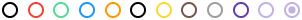
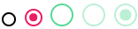
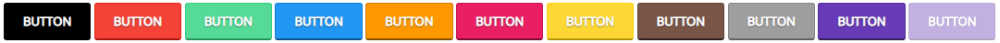
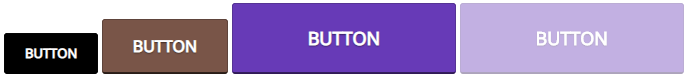
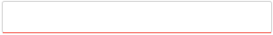

# Material Form Components
A few basic web-form components styled with inspiration from the Google Material design language.

Each component has a various set of sizes (standard/medium/large) and can also use the same colour scheme as other components.

This library is wrote in Sass but the compiled [CSS document](material.css) is still available in this repository, as well as a [minified version](material.min.css).

[Live Preview](https://mark-eriksson.com/work/projects/MaterialFormComponents/)

## Features
* [Checkboxes](#checkboxes)
* [Pill-styled checkboxes](#pill-checkboxes)
* [Radio buttons](#radio-buttons)
* [Labels](#labels)
* [Alerts](#alerts)
* [Buttons](#buttons)
* [Text fields](#text-fields)

## Colours
* Red (#f44336)
* Green (#56da97)
* Blue (#2196f3)
* Orange (#ff9800)
* Pink (#e91e63)
* Yellow (#fdd835)
* Brown (#795548)
* Grey (#9e9e9e)
* Purple (#673ab7)

## Previews

### Checkboxes
#### Unchecked

#### Checked

#### Various sizes


### Pill checkboxes
#### Unchecked

#### Checked

#### Various sizes


### Radio buttons
#### Unchecked

#### Checked

#### Various sizes


### Labels
#### Normal state

#### Various styles

#### Various sizes


### Alerts
#### Normal state

#### Various sizes


### Buttons
#### Normal state

#### Various sizes


### Text fields
#### Normal state

#### Focused state

#### Various sizes


## Usage
If you don't want to use a coloured component, just omit the `material--x` class from the class list of your element, where `x` is a colour name.
If your element is single-lined, you add the colour to the element itself, if it contains a wrapping `div`, you must attach the colour to that.

Different sizes can be applied by adding `medium` or `large` to the same class list as your component colour. For example: `<div class="checkbox material--red medium">` or `<input type="radio" class="radio material--pink large" />`

To disable an element, just add the HTML attribute `disabled` to the form element and it will disable the rest of the styling. It applies an alpha-transparency of 0.4 (except for pill-checkboxes as you are able to see through the toggle-button) and sets a 'not-allowed' cursor upon hover.

### Checkboxes
```html
<div class="checkbox material--red">
  <input type="checkbox" />
  <div class="checkbox-tick"></div>
</div>
```

### Pill checkboxes
```html
<div class="pill-checkbox material--green">
  <input type="checkbox" />
  <div class="pill-checkbox--toggle"></div>
</div>
```

### Labels
#### Normal
```html
<label class="label">Label</label>
```
#### Styles
##### Rounded
```html
<label class="label rounded">Rounded</label>
```
##### Inverted
```html
<label class="label inverted material--blue">Inverted colours</label>
```

### Radio buttons
```html
<input type="radio" class="radio material--blue" />
```

### Buttons
```html
<button type="button" class="button material--brown" />
```

### Text fields
```html
<div class="textfield-wrapper material--orange">
  <input type="text" class="textfield" />
  <div class="textfield-bar"></div>
</div>
```
